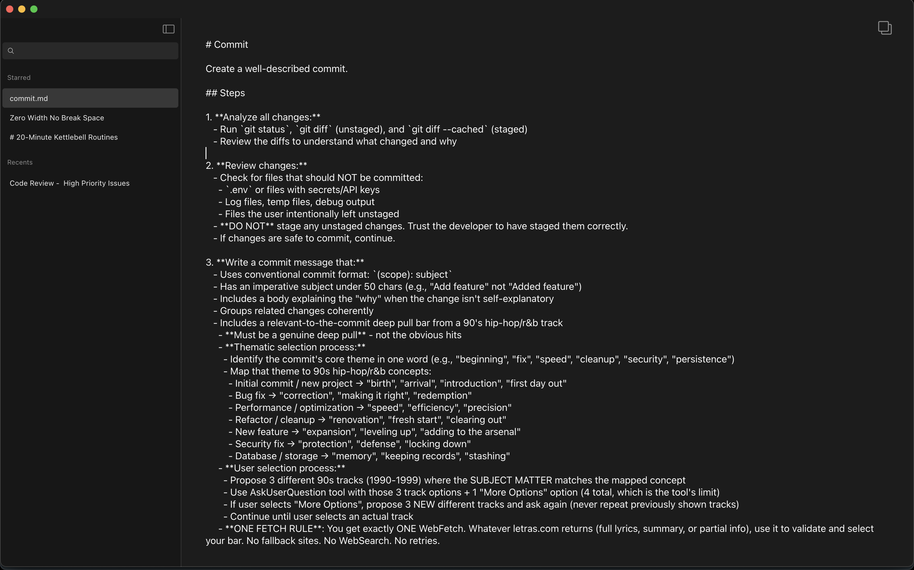

# Kopi

A native macOS clipboard manager built with Rust and GPUI.

## Overview

Kopi monitors the system clipboard for new text content and maintains a persistent, searchable history of copied items. Users can organize clips with favorites, rename entries, edit content, and quickly re-copy items to the clipboard.



## Features

- **Clipboard Monitoring**: Automatically captures text copied from any application
- **Persistent History**: All clipboard entries are stored in a SQLite database
- **Favorites**: Star important clips for quick access in the Starred section
- **Inline Editing**: Edit clipboard content directly in the app with auto-save
- **Rename Entries**: Right-click to rename entries for better organization
- **Soft Delete with Undo**: Delete items with a 5-second undo window
- **Light & Dark Mode**: Follows system appearance preferences
- **Window Persistence**: Remembers window size and position across launches
- **Privacy Protection**: Automatically excludes content copied from most password managers

### Handling Secrets

Kopi automatically excludes clipboard content from popular password manager applications (1Password, Bitwarden, LastPass, Dashlane, KeePassXC, Keeper) by detecting their pasteboard UTIs.

**IMPORTANT** API keys, tokens, and other secrets copied from text editors, terminals, or websites are currently stored in Kopi clipboard history. We're exploring options for detecting and excluding these in a useful way, but for now be aware that copying sensitive credentials will create records in Kopi.

### Deleting Entries

When you delete an entry, it's soft-deleted with a 5-second undo window. After that, the entry is hidden from the UI but remains in the database for 24 hours before being permanently removed by a background cleanup task.

To permanently delete all soft-deleted entries immediately, use **Kopi → Clear Deleted Items** from the menu bar.

## Requirements

- macOS (Intel or Apple Silicon)
- Rust 1.85+ (required for Rust 2024 edition)

## Building

```bash
cargo build --release
```

The compiled application can be bundled as a macOS app using:

```bash
cargo bundle --release
```

## Development

Run with hot-reload during development:

```bash
./script/dev
```

Run tests:

```bash
cargo test
```

Run linting:

```bash
./script/lint
```

Bundle as macOS app:

```bash
./script/bundle-mac
```

## Architecture

Built with:
- **Rust** for native performance and safety
- **GPUI** for the user interface (same framework as Zed editor)
- **SQLite** via rusqlite for data persistence
- **arboard** for cross-platform clipboard access

## Data Storage

Clipboard entries are stored in:
```
~/Library/Application Support/kopi/kopi.db
```

**Security Note:** The database is **not encrypted**. Anyone with access to your filesystem can read your clipboard history. Do not use Kopi on shared machines where other users have file access.

## Privacy

Kopi excludes clipboard content from password manager applications:
- Content marked as transient or concealed per [nspasteboard.org](https://nspasteboard.org) conventions
- Content from password managers (1Password, Bitwarden, LastPass, Dashlane, KeePassXC, Keeper)

Password manager content is never stored in the clipboard history database. Other content, including API keys and secrets, is currently stored.

## License

[MIT](LICENSE.md)
